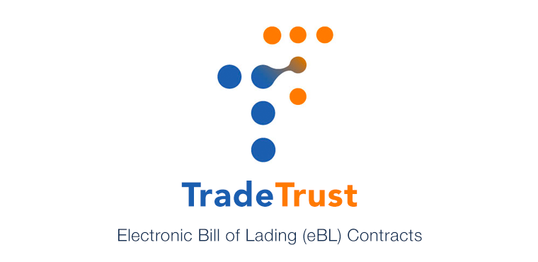

<h1 align="center">
  <p align="center">Token Registry</p>
  <a href="https://tradetrust.io"></a>
</h1>

<p align="center">
    <a href="https://tradetrust.io">TradeTrust</a> Electronic Bill of Lading (eBL)
</p>

<p align="center">
  <a href="https://circleci.com/gh/Open-Attestation/token-registry/tree/master" alt="Circle CI"></a>
  <a href="https://codecov.io/gh/Open-Attestation/token-registry" alt="Code Coverage"></a>
  <a href="https://www.npmjs.com/package/@govtechsg/token-registry" alt="NPM"></a>
  
</p>

The Electronic Bill of Lading (eBL) is a digital document that can be used to prove the ownership of goods. It is a standardised document that is accepted by all major shipping lines and customs authorities. The [Token Registry](https://github.com/Open-Attestation/token-registry) repository contains both the smart contract
code for token registry (in `/contracts`) as well as the node package for using this library (in `/src`).

## Table of Contents

- [Installation](#installation)
- [Usage](#usage)
  - [TradeTrustToken](#tradetrusttoken)
  - [Title Escrow](#title-escrow)
  - [Title Escrow Signable (Experimental)](#title-escrow-signable-experimental)
  - [Provider & Signer](#provider--signer)
  - [Roles and Access](#roles-and-access)
- [Deployment](#deployment)
  - [Quick Start](#quick-start)
  - [Advanced Usage](#advanced-usage)
    - [Token Contract](#token-contract)
      - [Stand-alone Contract](#stand-alone-contract)
      - [Using an existing Title Escrow Factory](#using-an-existing-title-escrow-factory)
    - [Title Escrow Factory](#title-escrow-factory)
      - [Deploy a new Title Escrow Factory](#deploy-a-new-title-escrow-factory)
  - [Verification](#verification)
  - [Network Configuration](#network-configuration)
- [Configuration](#configuration)
- [Development](#development)
  - [Scripts](#scripts)
- [Subgraph](#subgraph)
- [Notes](#notes)

## Installation

```sh
npm install --save @govtechsg/token-registry
```

---

## Usage

To use the package, you will need to provide your own
Web3 [provider](https://docs.ethers.io/v5/api/providers/api-providers/)
or [signer](https://docs.ethers.io/v5/api/signer/#Wallet) (if you are writing to the blockchain).
This package exposes the [Typechain (Ethers)](https://github.com/dethcrypto/TypeChain/tree/master/packages/target-ethers-v5) bindings for the contracts.

### TradeTrustToken

The `TradeTrustToken` is a Soulbound Token (SBT) tied to the Title Escrow. The SBT implementation is loosely based on OpenZeppelin's implementation of the [ERC721](http://erc721.org/) standard.
An SBT is used in this case because the token, while can be transferred to the registry, is largely restricted to its designated Title Escrow contracts.
See issue [#108](https://github.com/Open-Attestation/token-registry/issues/108) for more details.

#### Connect to existing token registry

```ts
import { TradeTrustToken__factory } from "@govtechsg/token-registry/contracts";

const connectedRegistry = TradeTrustToken__factory.connect(tokenRegistryAddress, signer);
```

#### Issuing a Document

```ts
await connectedRegistry.mint(beneficiaryAddress, holderAddress, tokenId);
```

#### Restoring a Document

```ts
await connectedRegistry.restore(tokenId);
```

#### Accept/Burn a Document

```ts
await connectedRegistry.burn(tokenId);
```

### Title Escrow

The Title Escrow contract is used to manage and represent the ownership of a token between a beneficiary and holder.
During minting, the Token Registry will create and assign a Title Escrow as the owner of that token.
The actual owners will use the Title Escrow contract to perform their ownership operations.

#### Connect to Title Escrow

```ts
import { TitleEscrow__factory } from "@govtechsg/token-registry/contracts";

const connectedEscrow = TitleEscrow__factory.connect(existingTitleEscrowAddress, signer);
```

#### Transfer of Beneficiary/Holder

Transferring of beneficiary and holder within the Title Escrow relies on the following methods:

```solidity
function transferBeneficiary(address beneficiaryNominee) external;

function transferHolder(address newHolder) external;

function transferOwners(address beneficiaryNominee, address newHolder) external;

function nominate(address beneficiaryNominee) external;

```

The `transferBeneficiary` transfers only the beneficiary and `transferHolder` transfers only the holder.
To transfer both beneficiary and holder in a single transaction, use `transferOwners`. Transfer of beneficiary will require a nomination done through the `nominate` method.

#### Surrendering/Burning a Document

Use the `surrender` method in the Title Escrow.

```solidity
function surrender() external;

```

Example:

```ts
await connectedEscrow.surrender();
```

#### Accessing the Current Owners

The addresses of the current owners can be retrieved from the `beneficiary`, `holder` and `nominee` methods.

Example:

```ts
const currentBeneficiary = await connectedEscrow.beneficiary();

const currentHolder = await connectedEscrow.holder();

const nominatedBeneficiary = await connectedEscrow.nominee();
```

### Title Escrow Signable (Experimental)

This is similar to the [Title Escrow](#title-escrow) with the additional support for off-chain nomination and endorsement of beneficiary nominees. The on-chain nominee will take precedence.
The current beneficiary will initiate the transfer transaction with the endorsement.

This feature could help to save on gas fees for cases where there are frequent nominations and endorsements between the owners.

Currently, this is not the default Title Escrow. To use this version of the Title Escrow, you will need to make some changes to the `TitleEscrowFactory.sol` file before deployment by following these steps:

```solidity
// Step 1. Import the TitleEscrowSignable contract
import "./TitleEscrowSignable.sol";

contract TitleEscrowFactory is ITitleEscrowFactory {
  // ...

  constructor() {
    // Step 2. Look for this line in the constructor
    implementation = address(new TitleEscrow());
    // Step 3. Replace the line in Step #2 with the following line:
    implementation = address(new TitleEscrowSignable());
  }

  // ...
}

```

Note that this is currently an experimental feature. Implementers will need to setup a "book-keeping" backend for the signed data.

### Provider & Signer

Different ways to get provider or signer:

```ts
import { Wallet, providers, getDefaultProvider } from "ethers";

// Providers
const mainnetProvider = getDefaultProvider();
const goerliProvider = getDefaultProvider("goerli");
const metamaskProvider = new providers.Web3Provider(web3.currentProvider); // Will change network automatically

// Signer
const signerFromPrivateKey = new Wallet("YOUR-PRIVATE-KEY-HERE", provider);
const signerFromEncryptedJson = Wallet.fromEncryptedJson(json, password);
signerFromEncryptedJson.connect(provider);
const signerFromMnemonic = Wallet.fromMnemonic("MNEMONIC-HERE");
signerFromMnemonic.connect(provider);
```

### Roles and Access

Roles are useful for granting users to access certain functions only. Currently, here are the designated roles meant for the different key operations.

| Role           | Access                              |
| -------------- | ----------------------------------- |
| `DefaultAdmin` | Able to perform all operations      |
| `MinterRole`   | Able to mint new tokens             |
| `AccepterRole` | Able to accept a surrendered token  |
| `RestorerRole` | Able to restore a surrendered token |

A trusted user can be granted multiple roles by the admin user to perform different operations.
The following functions can be called on the token contract by the admin user to grant and revoke roles to and from users.

#### Grant a role to a user

```ts
import { constants } from "@govtechsg/token-registry";

await tokenRegistry.grantRole(constants.roleHash.MinterRole, "0xbabe");
```

Can only be called by default admin or role admin.

#### Revoke a role from a user

```ts
import { constants } from "@govtechsg/token-registry";

await tokenRegistry.revokeRole(constants.roleHash.AccepterRole, "0xbabe");
```

Can only be called by default admin or role admin.

#### Setting a role admin

The standard setup does not add the role-admin roles so that users don't deploy (and, hence, pay the gas for) more than what they need.
If you need a more complex setup, you can add the admin roles to the designated roles.

```ts
import { constants } from "@govtechsg/token-registry";
const { roleHash } = constants;

await tokenRegistry.setRoleAdmin(roleHash.MinterRole, roleHash.MinterAdminRole);
await tokenRegistry.setRoleAdmin(roleHash.RestorerRole, roleHash.RestorerAdminRole);
await tokenRegistry.setRoleAdmin(roleHash.AccepterRole, roleHash.AccepterAdminRole);
```

Can only be called by default admin.

# Deployment

Hardhat is used to manage the contract development environment and deployment. This repository provides a couple of
Hardhat tasks to simplify the deployment process.

Starting from v4, we have included an easy and cost-effective way to deploy the contracts while also keeping options available for advanced users to setup the contracts their preferred way.

> 💡 Please ensure that you have setup your configuration file before deployment.
> See [Configuration](#configuration) section for more details. The deployer (configured in your `.env` file) will be made the default admin.

## Quick Start

For users who want to quickly deploy their contracts without too much hassle, you’ll only have to supply the name and symbol of your token to the command, and you’re ready to roll!

```
npx hardhat deploy:token --network mumbai --name "The Great Shipping Co." --symbol GSC
```

👆 This is the easiest and most cost-effective method to deploy. Currently, this is supported on Ethereum, Goerli, Sepolia, Polygon and Polygon Mumbai. The deployed contract will inherit all the standard functionality from our on-chain contracts. This helps to save deployment costs and make the process more convenient for users and integrators.

> 💡 Remember to supply the`--network` argument with the name of the network you wish to deploy on.
> See [Network Configuration](#network-configuration) section for more info on the list of network names.

## Advanced Usage

For experienced users who would like to have more control over their setup (or have extra 💰 to spend 💸), we have provided a few other options and commands.
However, you should be aware that, depending on what you’re doing, the gas costs could be higher than the method described in [Quick Start](#quick-start).
You should already know what you are doing when using any of these options.

### Token Contract

Deploys the token contract.

```
Usage: hardhat [GLOBAL OPTIONS] deploy:token --factory <STRING> --name <STRING> [--standalone] --symbol <STRING> [--verify]

OPTIONS:

  --factory   	Address of Title Escrow factory (Optional)
  --name      	Name of the token
  --standalone	Deploy as standalone token contract
  --symbol    	Symbol of token
  --verify    	Verify on Etherscan

deploy:token: Deploys the TradeTrust token
```

> 💡 Tip: Note that the `--factory` argument is optional. When not provided, the task will use the default Title Escrow Factory.
> You can also reuse a Title Escrow factory that you have previously deployed by passing its address to the `--factory` argument.

#### Stand-alone Contract

If you would like to deploy your own modified version of the token contract or simply just deploy your own copy of the contract, you can use the `--standalone` flag.

```
npx hardhat deploy:token --network mumbai --name "The Great Shipping Co." --symbol GSC --verify --standalone
```

👆 This will deploy a _full token contract_ with the name _The Great Shipping Co._ under the symbol _GSC_ on the Polygon _mumbai_
network using the default Title Escrow factory. The contract will also be _verified_ on Etherscan.

#### Using an existing Title Escrow Factory

To use an existing or your own version of Title Escrow factory, you can supply its address to the `—factory` argument. This option only works with the `--standalone` flag.

```
npx hardhat deploy:token --network polygon --name "The Great Shipping Co." --symbol GSC --factory 0xfac70
```

👆 This will deploy a "cheap" token contract with the name _The Great Shipping Co._ under the symbol _GSC_ on the _Polygon Mainnet_
network using an existing Title Escrow factory at `0xfac70`.

### Title Escrow Factory

Deploys the Title Escrow factory.

```
Usage: hardhat [GLOBAL OPTIONS] deploy:factory [--verify]

OPTIONS:

  --verify	Verify on Etherscan

deploy:factory: Deploys a new Title Escrow factory
```

#### Deploy a new Title Escrow Factory

If you want to deploy your own modified version or simply want to have your own copy of the Title Escrow factory, you can use this command:

```
npx hardhat deploy:factory --network rinkeby
```

👆 This will deploy a new Title Escrow factory on the _Rinkeby_ network without verifying the contract.
To verify the contract, pass in the `--verify` flag.

## Verification

When verifying the contracts through either the Hardhat's verify plugin or passing the `--verify` flag to the deployment
tasks (which internally uses the same plugin), you will need to include your correct API key, depending on the network, in your `.env` configuration. See [Configuration](#configuration) section for more info.

- For Ethereum, set `ETHERSCAN_API_KEY`.
- For Polygon, set `POLYGONSCAN_API_KEY`.

## Network Configuration

Here's a list of network names currently pre-configured:

- `mainnet` (Ethereum)
- `goerli`
- `sepolia`
- `polygon` (Polygon Mainnet)
- `mumbai` (Polygon Mumbai)

> 💡 You can configure existing and add other networks you wish to deploy to in the `hardhat.config.ts` file.

## Configuration

Create a `.env` file and add your own keys into it. You can rename from the sample file `.env.sample` or copy the
following into a new file:

```
# Infura
INFURA_APP_ID=

# API Keys
ETHERSCAN_API_KEY=
POLYGONSCAN_API_KEY=
COINMARKETCAP_API_KEY=

# Deployer Private Key
DEPLOYER_PK=

# Mnemonic words
MNEMONIC=
```

Only either the `DEPLOYER_PK` or `MNEMONIC` is needed.

# Development

This repository's development framework uses [HardHat](https://hardhat.org/getting-started/).

Tests are run using `npm run test`, more development tasks can be found in the package.json scripts.

### Scripts

```sh
npm install
npm test
npm run lint
npm run build

# See Deployment section for more info
npx hardhat deploy:token
npx hardhat deploy:factory
npx hardhat deploy:token:impl
```

## Subgraph

Check out our [Token Registry Subgraph](https://github.com/Open-Attestation/token-registry-subgraph) Github repository
for more information on using and deploying your own subgraphs for the Token Registry contracts.

## Notes

- The contracts have not gone through formal audits yet. Please use them at your own discretion.
